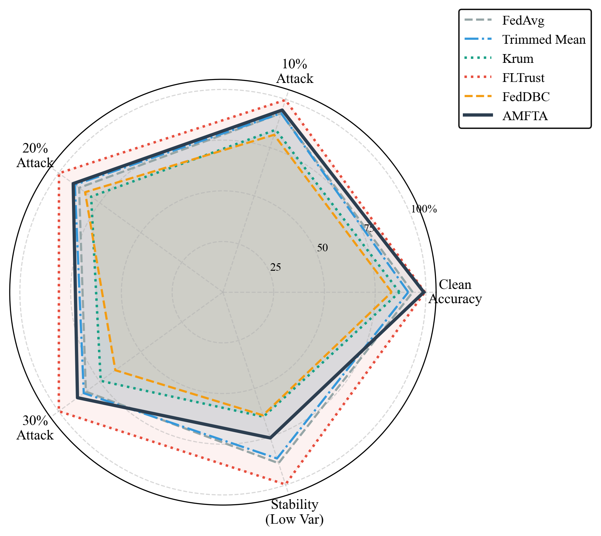
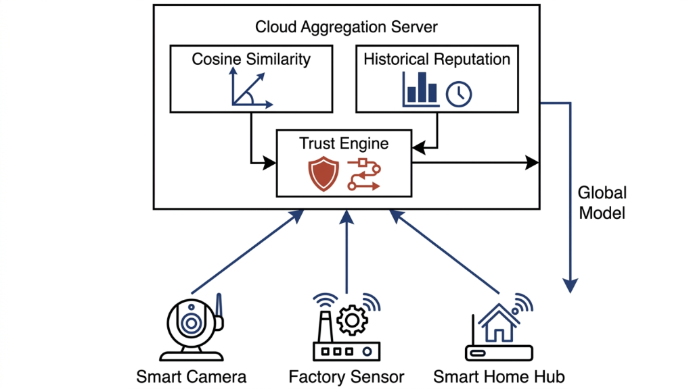
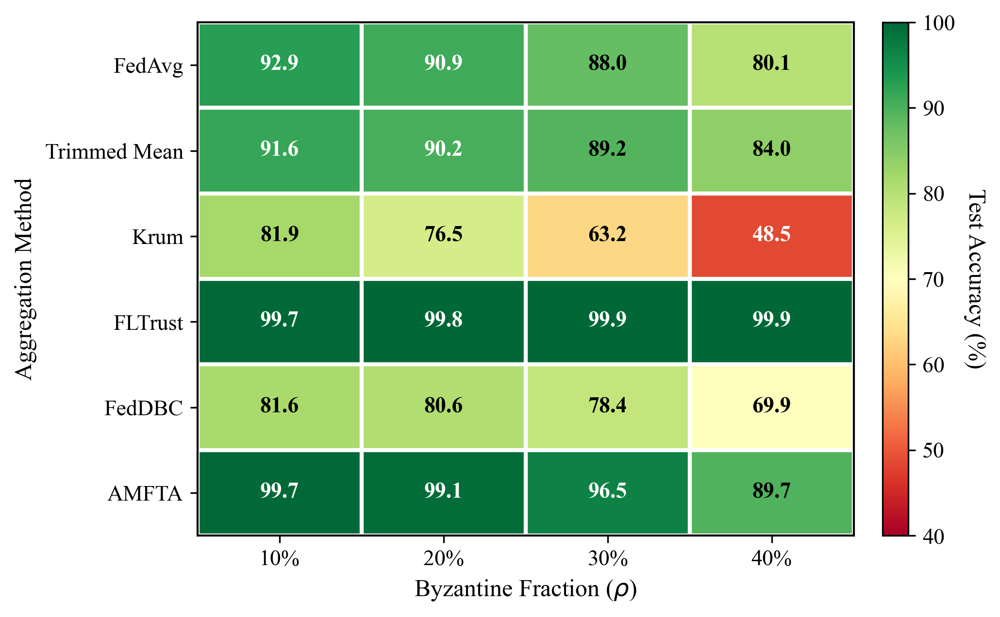
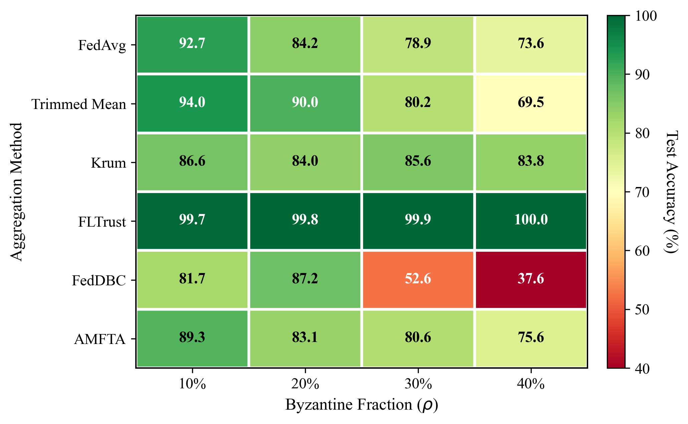

<p align="center">
  
</p>

# AMFTA-FL: Adaptive Multi-Factor Trust Aggregation
### Byzantine-Robust Federated Learning in Non-IID Smart City IoT Networks

[](https://opensource.org/licenses/MIT)
[](https://www.python.org/downloads/)
[](https://github.com/psf/black)
[](https://pytorch.org/)

An engineering-grade research software artifact and comparative benchmarking framework for evaluating **Byzantine-resilient server-side aggregation strategies** in non-IID federated network intrusion detection systems (NIDS). This repository contains the official PyTorch implementation evaluated on the real-world **TON_IoT** smart city telemetry dataset under diverse model-poisoning and data-poisoning threat models.

---


## Project Overview

<p align="center">
  
</p>

Standard federated aggregation protocols (e.g., `FedAvg`) are highly vulnerable to Byzantine failures—situations where malicious or compromised edge nodes inject poisoned models or corrupt data into the global training process. Defenses like Krum or Trimmed Mean degrade significantly under highly Non-IID data distributions (such as Dirichlet $\alpha = 0.5$) common in IoT networks.

**AMFTA-ND (Adaptive Multi-Factor Trust Aggregation - No Defense Buffer)** solves this by dynamically synthesizing two trust metrics without requiring a clean server-side root dataset:
1. **Historical Trust Momentum:** Tracking the exponential moving average (EMA) of a node's historical reputation.
2. **Density-Based Spatial Clustering:** Utilizing DBSCAN to isolate outlier parameter updates in the coordinate space.

---

## Peer Reviewer Quick Start (Zero-Download)

The benchmarking suite includes a `--use_synthetic` flag, allowing you to instantly run the AMFTA training engine with synthetically generated non-IID data without downloading the multi-gigabyte TON_IoT dataset.

```bash
# Run a quick 10-round benchmark with 30% Byzantine attackers
python experiments/run_main.py \
    --method amfta \
    --attack label_flipping \
    --byzantine_fraction 0.3 \
    --num_rounds 10 \
    --use_synthetic
```

### Standalone API Usage
You can drop the AMFTA aggregator into any standard PyTorch federated training loop:

```python
import torch
from amfta.aggregation import AMFTAAggregator

# 1. Initialize the aggregator with defense hyperparameters
aggregator = AMFTAAggregator(
    alpha=0.6,        # Historical momentum weight
    beta=0.4,         # Quality-factor weight
    eps=0.5,          # DBSCAN density radius
    min_samples=3     # Minimum density threshold
)

# 2. Collect local model parameters (state_dicts) from edge clients
client_updates = [client.get_weights() for client in edge_devices]

# 3. Perform Byzantine-robust aggregation
global_model = aggregator.aggregate(
    client_updates, 
    server_reference=None # Set to None for AMFTA-ND mode
)
```

---

## Installation

> [!NOTE]
> This repository uses `make` targets for streamlined installation and testing. Python 3.9+ is required.

### 1. Clone the Repository
```bash
git clone https://github.com/adeliusa486/Adaptive-Multi-Factor-Trust-Aggregation-for-Byzantine-Robust-Federated-Learning-in-IoT-Networks.git
cd Adaptive-Multi-Factor-Trust-Aggregation-for-Byzantine-Robust-Federated-Learning-in-IoT-Networks
```

### 2. Install Dependencies
```bash
# Install runtime requirements (PyTorch, scikit-learn, pandas)
make install

# (Optional) Install development and testing dependencies
make install-dev
```

---

## Evaluated Threat Models & Defenses

### 1. Label Flipping (Data Poisoning)

Malicious edge nodes systematically invert training labels prior to local training, forcing the global model to learn incorrect decision boundaries.

<p align="center">
  
</p>

### 2. Gaussian Noise Injection (Model Poisoning)

Adversaries corrupt local model weight updates by adding high-variance isotropic Gaussian noise ($\mathcal{N}(0, \sigma^2)$) to disrupt global convergence.

<p align="center">
  
</p>

---

## Empirical Results

Below is a subset of the empirical results demonstrating the F1-Score degradation under a 30% Label Flipping attack fraction.

| Defense Strategy | Byzantine Fraction | Mean Accuracy | Std Dev |
|------------------|-------------------|---------------|---------|
| **FedAvg**       | 30%               | 87.96%        | +/- 6.54% |
| **Krum**         | 30%               | 63.18%        | +/- 15.43%|
| **Trimmed Mean** | 30%               | 89.25%        | +/- 8.42% |
| **FedDBC**       | 30%               | 78.44%        | +/- 7.31% |
| **AMFTA-ND (Ours)** | 30%            | **96.53%**    | +/- 2.27% |

*Note: The proposed AMFTA method significantly reduces variance (Std Dev) across highly non-IID client distributions while preserving state-of-the-art global accuracy.*

---

## Repository Architecture

```text
amfta-fl/
├── amfta/                      # Core package (aggregators, attacks, datasets, models)
├── configs/                    # YAML configuration files for hyperparameter sweeps
├── data/                       # TON_IoT dataset preprocessing and loading logic
├── evaluation/                 # Metrics calculation and statistical evaluation engines
├── experiments/                # CLI drivers (run_main.py, run_ablation.py)
├── figures/                    # Generated publication-quality PDF and PNG plots
├── results/                    # Serialized JSON run logs across all evaluated seeds
├── scripts/                    # Bash utility scripts for batch processing
└── tests/                      # Automated unit and integration test suites (pytest)
```

---

## Experimental Workflow

To accurately reproduce the full benchmarks reported in the publication, follow this pipeline:

1. **Preprocess Raw Data**
   ```bash
   make preprocess
   ```
2. **Run Full Evaluation Sweep**
   Executes the benchmark across all baselines, threat models, and Byzantine fractions.
   ```bash
   python experiments/run_full_study.py --log_level INFO
   ```
3. **Compile Figures & Tables**
   Parses the serialized JSON artifacts in `results/` to generate visual plots.
   ```bash
   python experiments/build_paper_figures.py
   python experiments/build_paper_tables.py
   ```

---

## Testing & Quality Assurance

This framework maintains strict CI/CD guidelines. Ensure all tests pass before submitting pull requests.

```bash
# Run the fast unit test suite
make test-unit

# Run full integration tests (evaluates aggregation correctness)
make test-integration

# Check code formatting (Black & isort)
make format-check
```

---

