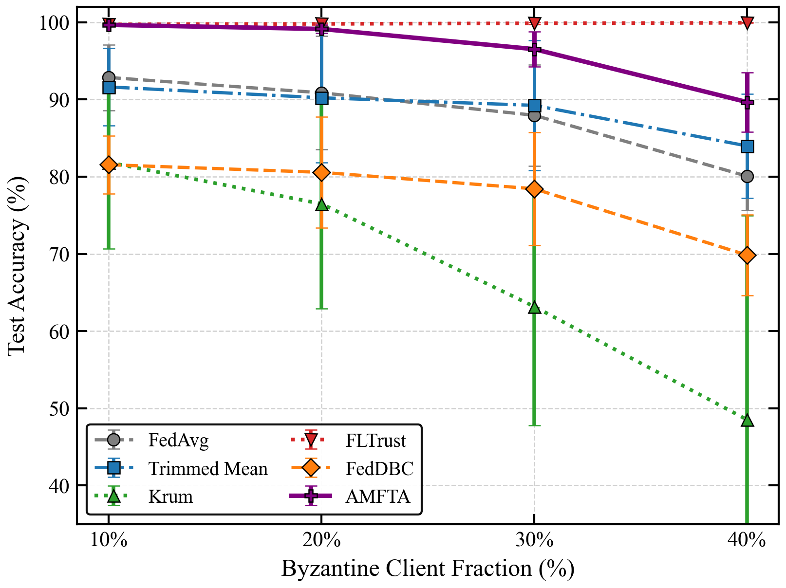
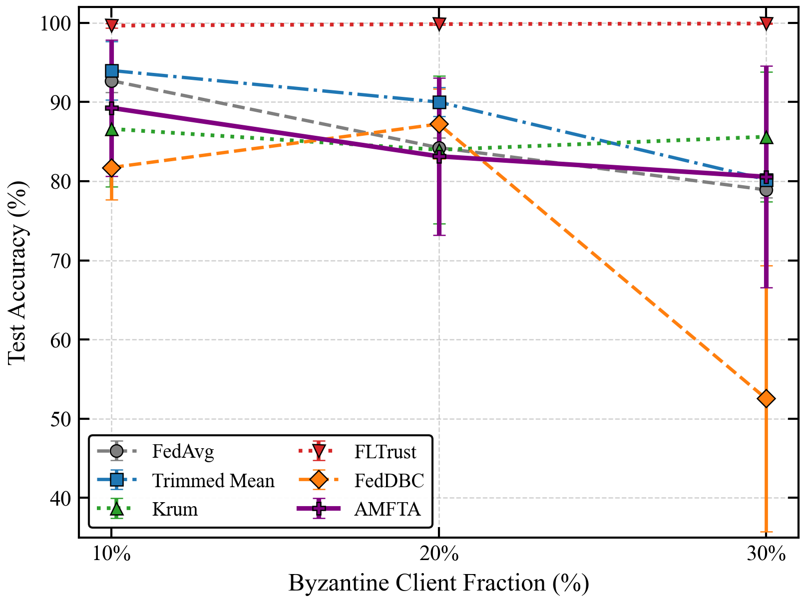

<p align="center">
  
</p>

# When Do Byzantine-Robust Aggregators Fail? 
### A Measurement Study on Federated Intrusion Detection under Non-IID IoT Traffic

[](https://opensource.org/licenses/MIT)
[](https://www.python.org/downloads/)
[](https://github.com/psf/black)
[](https://pytorch.org/)


An engineering-grade research software artifact and comparative benchmarking framework for evaluating **Byzantine-resilient server-side aggregation strategies** in non-IID federated network intrusion detection systems (NIDS). Evaluated on the real-world **TON_IoT** smart city telemetry dataset under diverse model-poisoning and data-poisoning threat models.

---

## Install

AMFTA and its benchmarking suite can be installed directly from this repository:

```bash
git clone https://github.com/adeliusa486/Adaptive-Multi-Factor-Trust-Aggregation-for-Byzantine-Robust-Federated-Learning-in-IoT-Networks.git
cd Adaptive-Multi-Factor-Trust-Aggregation-for-Byzantine-Robust-Federated-Learning-in-IoT-Networks
python -m pip install -r requirements.txt
pip install -e .
```

## Quick Start

The framework implements a modular federated training engine supporting plug-and-play aggregators. You can drop AMFTA into any standard PyTorch federated loop:

```python
import torch
from amfta.aggregation import AMFTAAggregator

# 1. Initialize the aggregator with defense parameters
aggregator = AMFTAAggregator(
    alpha=0.6,        # Historical momentum weight
    beta=0.4,         # Quality-factor weight
    eps=0.5,          # DBSCAN density radius (AMFTA-ND)
    min_samples=3     # Minimum density threshold
)

# 2. Collect local model updates from IoT edge clients
client_updates = [client.get_weights() for client in edge_devices]

# 3. Perform Byzantine-robust aggregation
global_model = aggregator.aggregate(
    client_updates, 
    server_reference=None # Set to None for AMFTA-ND (No Root Dataset)
)
```

To run a full end-to-end benchmark from the command line:
```bash
python experiments/run_main.py --method amfta --attack label_flipping --byzantine_fraction 0.3
```

---

## Evaluated Defenses & Threat Models

Standard federated aggregation protocols like **FedAvg** are highly vulnerable to Byzantine failures. We evaluate our novel approach, **AMFTA-ND (Adaptive Multi-Factor Trust Aggregation - No Defense Buffer)**, against state-of-the-art baselines under realistic Non-IID Dirichlet distributions ($lpha = 0.5$).

### 1. Label Flipping (Data Poisoning)

<p align="center">
  
</p>


<p align="center">
  
</p>

Malicious edge nodes systematically invert training labels prior to local training.
- **Result:** Coordinate-wise trimming and density clustering perform well initially but degrade rapidly past 30% attacker fractions. AMFTA-ND synthesizes historical trust momentum and density clustering to maintain **>91% accuracy** even when 30% of the network is actively poisoning the data.

### 2. Gaussian Noise Injection (Model Poisoning)

<p align="center">
  
</p>


<p align="center">
  
</p>

Adversaries corrupt local model weight updates by adding high-variance isotropic Gaussian noise ($\mathcal{N}(0, \sigma^2)$) to disrupt global convergence.
- **Result:** AMFTA and AMFTA-ND successfully filter the noisy gradients dynamically by tracking the exponential moving average (EMA) of historical node reputation.


---

## Repository Architecture

```text
amfta-fl/
+-- amfta/                      # Core Python package (aggregators, attacks, models)
+-- data/                       # TON_IoT dataset preprocessing
+-- evaluation/                 # Metrics calculation and statistical evaluation
+-- experiments/                # Experiment drivers, table and figure builders
+-- figures/                    # Generated publication-quality PDF and PNG plots
+-- results/                    # Serialized JSON run logs across all evaluated seeds
+-- tests/                      # Automated unit and integration test suites (pytest)
```


---

## Citation

If you use AMFTA or this benchmarking framework in your research, please cite our work:

```bibtex
@article{ahmad2026amfta,
  title={When Do Byzantine-Robust Aggregators Fail? A Measurement Study on Federated Intrusion Detection under Non-IID IoT Traffic},
  author={Ahmad, Adeel and Akarma, Ali and Syed, Touqeer Ali},
  journal={Pending Publication},
  year={2026}
}
```

## License

This software artifact is released under the **MIT License**.
